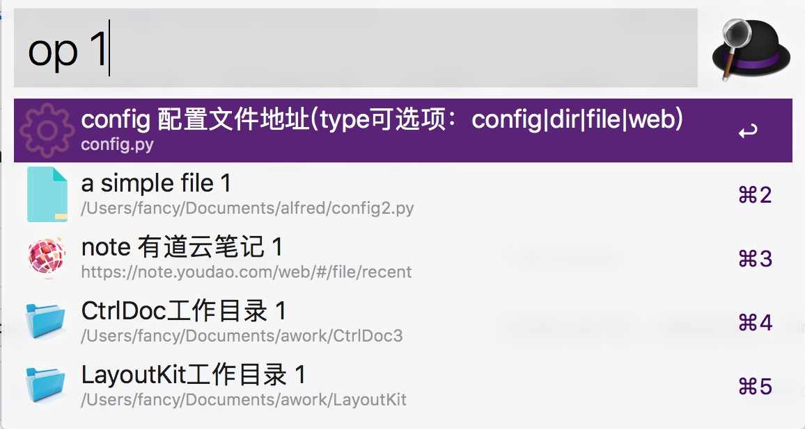

# open-dir-web-page-alfred-workflow
this is a alfred workflow,can quick open dir/file/web page in config file.

you can input "op config"
config the files|dirs|web pages

save config file

then input "op query"
you can search your page
press enter,will auto open file|dir|web page.

-------------------------------------------
输入 "op config"
将打开配置文件，参考sample，完成您的个性化配置。
保存配置文件（cmd+w可快速关闭当前编辑文件）

然后输入 "op 查询条件"
就可以搜索和匹配到您已经配置的选项
回车直接打开 文件 或 目录 或 网页

